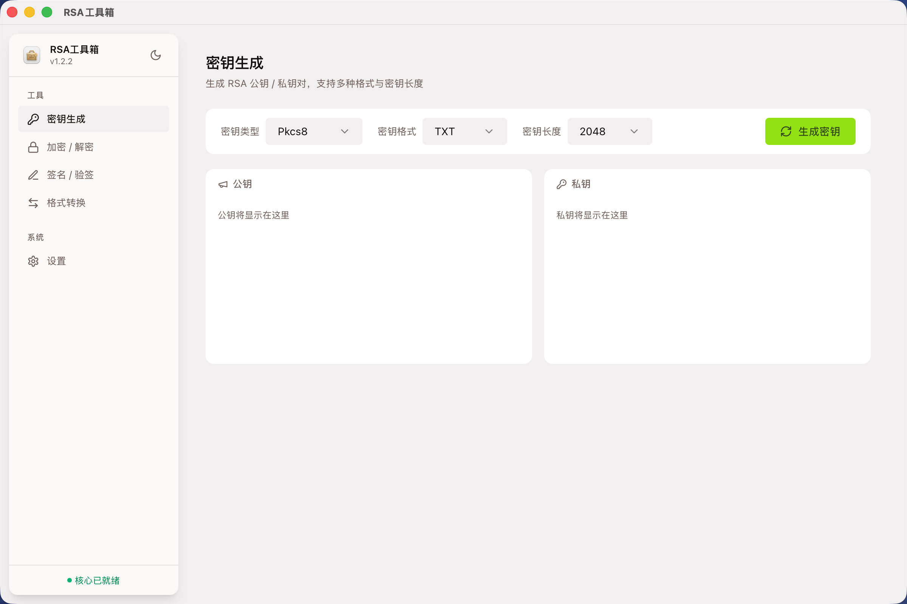
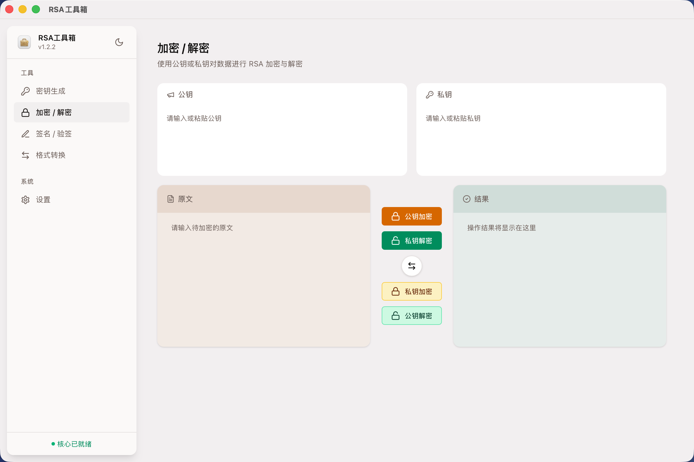
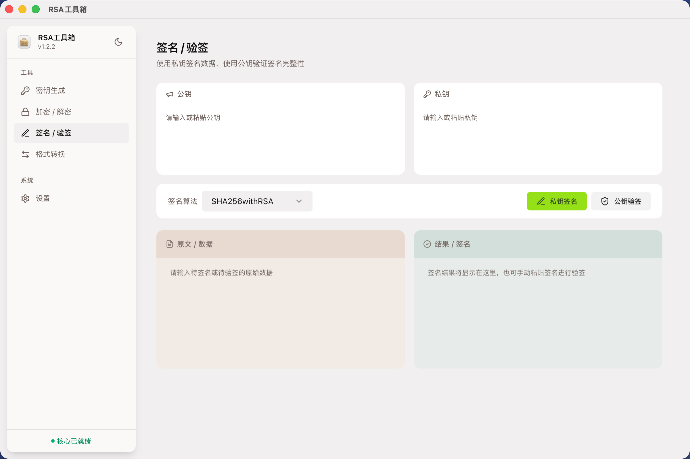
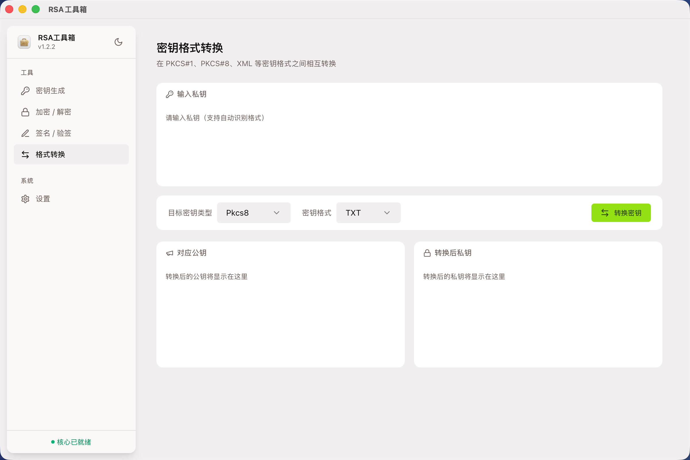
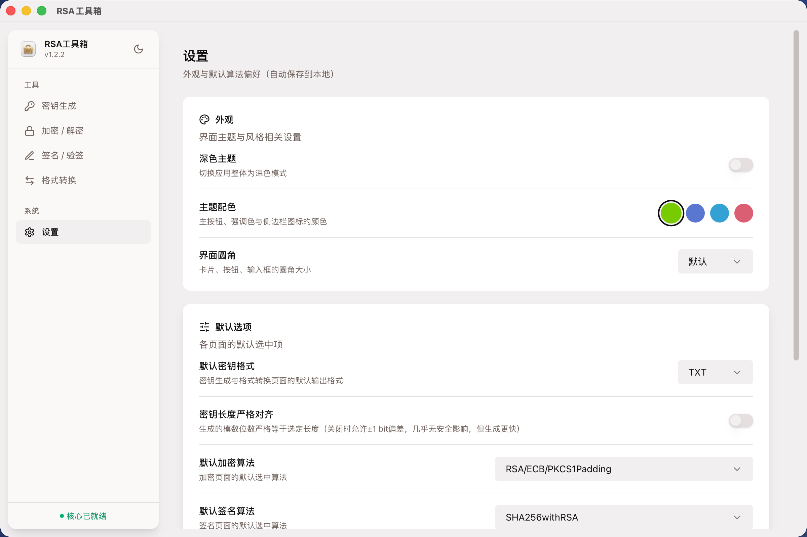

# RSA工具箱

跨平台桌面 RSA 密码学工具，基于 Tauri 2 + React 19 + .NET 9 WASM。

支持 macOS / Linux / Windows，提供密钥生成、加解密、签名验签、格式转换等功能。

## 技术栈

| 层级 | 技术 |
|------|------|
| 桌面壳 | [Tauri 2](https://v2.tauri.app/)（Rust） |
| 前端 | React 19 + TypeScript + Vite 5 |
| UI | Tailwind CSS v4 + [shadcn/ui](https://ui.shadcn.com/)（Radix UI） |
| 状态管理 | [Zustand](https://zustand.docs.pmnd.rs/)（localStorage 持久化） |
| 密码学核心 | .NET 9 Browser-WASM（BouncyCastle） |
| 加解密运行时 | Web Worker（`rsaWorker.js`） |

## 功能

| 模块 | 说明 |
|------|------|
| 🔑 **密钥生成** | 支持 1024/2048/4096 位 RSA 密钥，PKCS#1/PKCS#8/XML 格式，自动保存到本地 |
| 🔒 **加解密** | RSA 公钥加密 / 私钥解密，支持多种填充模式 |
| ✍️ **签名验签** | 支持 SHA1/SHA256/SHA384/SHA512 算法 |
| 🔄 **格式转换** | PEM ↔ XML 密钥格式互转，实时格式检测 |
| ⚙️ **设置** | 主题色、暗色模式、圆角、默认密钥参数、严格位对齐 |

## 界面预览

<p style="background:#FFF;padding:12px 3px;display:flex;justify-content:space-evenly;">
  
  
  
  
  
</p>

## 构建

### 前置条件

- [Node.js](https://nodejs.org/) ≥ 20 + [pnpm](https://pnpm.io/) ≥ 9
- [Rust](https://www.rust-lang.org/tools/install) ≥ 1.77
- [.NET SDK](https://dotnet.microsoft.com/download) ≥ 9.0
- Linux 额外需要：`libwebkit2gtk-4.1-dev libgtk-3-dev libayatana-appindicator3-dev librsvg2-dev`

### 开发

```bash
# 安装依赖
pnpm install

# 启动 Tauri 开发模式（含热重载）
pnpm tauri:dev

# 或仅启动前端（浏览器开发，WASM 功能降级）
pnpm dev
```

### 构建产物

```bash
pnpm tauri:build
```

产物位于 `src-tauri/target/release/bundle/`：
- macOS → `.dmg`
- Linux → `.AppImage`
- Windows → `.msi`

## 发布

GitHub Actions 自动构建，推送 Git tag 触发：

```bash
git tag v0.1.2
git push origin v0.1.2
```

流水线：`sync-version` → `build-macos / linux / windows`（三平台并行） → `Draft Release`

## 项目结构

```text
RsaToolBox.Crossfrom/
├── .github/workflows/release.yml  # CI/CD 自动发布流水线
├── public/
│   ├── logo.png                   # 应用图标
│   └── rsaWorker.js               # Web Worker（.NET WASM 运行时）
├── scripts/
│   └── sync-version.mjs           # 版本号同步脚本
├── src/
│   ├── components/                # UI 组件
│   ├── pages/                     # 页面组件
│   │   ├── KeyGeneratePage.tsx    # 密钥生成
│   │   ├── CryptPage.tsx          # 加解密
│   │   ├── SignPage.tsx           # 签名验签
│   │   ├── TransformPage.tsx      # 格式转换
│   │   └── SettingsPage.tsx       # 设置
│   ├── services/                  # 业务服务（WASM 互操作、文件系统、格式处理）
│   └── stores/                    # Zustand 状态
├── src-core/                      # .NET 9 WASM Browser App（RSA 密码学核心）
├── src-tauri/                     # Tauri Rust 项目（原生命令）
├── package.json
├── vite.config.ts
└── tsconfig.json
```

## 许可证

MIT
